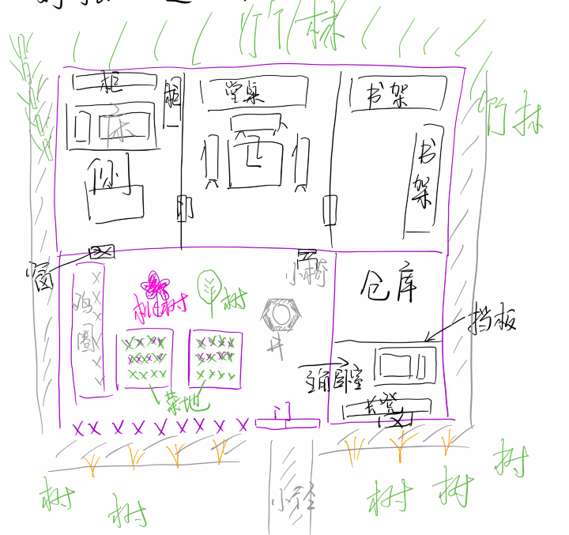

    Q#### 第一章 下山

主角表情: 平常(默认) 微笑 开心(大笑) 为难(委屈) 痛苦 愤怒 吃惊

【八年之后】

叶春泷(为难): 唔...

【清晨，阳光透过窗户斜射进来，屋内明晃晃的。】

叶春泷(为难): 好晒啊...

叶春泷(开心): 再睡一会，再睡一会...

描述: 叶春泷翻了个身，把被子拉过头顶继续睡过去。

【黑暗】

？？？: 快醒醒！！

？？？: 小子，都几点了还在睡！？

叶春泷(吃惊): 师父！

东流真人(厉声): 都辰时三刻了，快点起来做饭！

叶春泷(嘀咕): 怎么又是我了……

东流真人: 你说什么？

叶春泷(慌忙做出笑脸): 没什么……没说什么啊，师父。

东流真人: 哼！赶紧起来！

【东流真人转身离开，叶春泷抓了抓头(如果有的话)，没有起床动作的话直接黑屏切站立画面】

【……】

叶春泷：哈……好困啊……

**【选项】**  
是否开始新手教程？
> 是，在下初入江湖，还需指点一二。  
> 否，我是老江湖了。  
> 不必了，大道相通，我自行摸索。

叶春泷：早上做什么好呢？嗯，那就竹笋炒蛋吧。

叶春泷：先去拿个鸡蛋吧。

【叶春泷走出小房间，山上早晨的空气还有几分清冷，他不禁吸了一口凉气，紧了紧衣服。东流真人就在院子里竹木篱笆前的菜地间拨弄着什么的样子，叶春泷抿了抿嘴，为了不引起东流真人注意，轻声慢步地向对面院墙的鸡圈处走去。】

东流真人：咳哼！你小子在那里慢吞吞地磨蹭什么呢？

叶春泷：啊……好，好的！

【跑步切换教程】

叶春泷：师父已经把鸡放出去了，那倒是方便了。一个、两个……诶好，任务完成。

叶春泷：师父！我现在去后山拔点竹笋了啊，您要是等太急，就先自己生个火烧个粥，再做两个小菜！明儿个徒弟一定赶早起来做饭！

东流真人：你赶紧去！等野猴子睡醒了，别又叫被那群野畜生欺负了，丢人的紧。

叶春泷：好好！

【叶春泷出了院子门口。】

叶春泷(小声)：咧~臭老头儿！

东流真人：……

叶春泷：前天个风真大，这树枝都折在两棵树中间了，嘿！看小爷轻功了得！

【借助树林场景展开跳跃、攻击教学】

【出门向左一拐，便是一片满地杂乱树枝的小树林，是叶春泷私自习武练招之地。他轻车熟路般穿过林间，越往外走树木越是稀疏，树林出口便望见远处的竹林。竹林前边有几块垒起的青苔巨石，最外边环着一条小溪，溪水自上边的莲花峰发端，流到他们拨云尖这边处来。】

叶春泷：师父说的有道理，我得赶紧弄五根竹笋再说！要不然山上的猴子下来了，又要缠着我不放了。

【叶春泷走上前去，拔了竹笋后，忽然听到林子里有喊叫声传来。】

？？？：把我的包放下！快放下！你们这群畜生！

猴子：吱吱吱(笑)！

？？？：还笑是吧！再跑我就用剑了啊！

猴子：吱吱吱！

叶春泷(开心)：这是哪个倒霉蛋遇上那群野猴子了吧？

叶春泷：我要不要上去看一下呢？

> 过去看一下吧，或许能帮上什么忙……  
> 远远瞧下热闹，不打紧的。  
> 师父还在院里等着我呢，不要让老人家等着急了。

猴子：吱吱吱！

【三五只野猴子或在地上跑着，或在竹间荡着，向竹林出口处这边过来了，在瞧见这边的叶春泷后，它们继而又换着向竹林里边去了，其中地上一只猴子手上拖拽着一个细长的包袱。一个气喘吁吁的少年奔跑着跟在猴群后面，叶春泷看他装束眼熟，应该是青莲剑派子弟。】

叶春泷：是剑派里面的人啊！

**【选项一】**

叶春泷：兄弟，你这样追是追不到的！

**【选项二】**

叶春泷：兄弟，你这是要追到猴年马月啊！要不就算了吧，一个包袱而已。

？？？：你在这里说什么风凉话呢，那包袱里可有我最重要的东西！

叶春泷：重要的东西……那我且教你一招！

**【选项三】**

？？？：快帮我拦住这群猴子！别让他们跑了！

叶春泷：啊……好，但它们已经掉头跑了啊！

**【收束】**

叶春泷：你别这样追，这群畜生野的很，你越追它们跑的越欢脱！你不跟他们来硬的，它们就骑在你头上闹腾！你像我这样……

【叶春泷弯腰从地上拿起石头，做瞄准状。】

叶春泷：嘿……哈！没中，再来！

猴子：吱吱吱(怒)！

叶春泷：哈哈哈，这群小畜生们生气了！

？？？：……

？？？：兄台，这样真的好吗？你看它们围过来了……

叶春泷(拍拍手)：没关系没关系，你看惹它们生气了就不跑了吧！我这方法灵验的很。

？？？：可是我看它们有些生气……

叶春泷：嗨呀，平常要是我一个人可能还应付不了它们，今天我们两人，你还是青莲弟子，教训这群畜生还不是手到擒来？

？？？：其实在下……

叶春泷：要上了，别用剑伤到它们就好！

【一番争斗过后，野猴子四散而去……】

？？？：呼呼呼……累死我了。

叶春泷：给，你的东西。

？？？：谢谢兄台了，大清早的可真是气死我了。

叶春泷：看你也是青莲子弟，怎么对付个猴子也这么吃力？

？？？(挠挠头，有点难为情)：实不相瞒，我上山之后喜好阅读杂物，不务正业，疏于剑道……

？？？：不对呀，我看你除了轻功身法还算过得去，也都是些三脚猫的功夫啊。

叶春泷：嗨，那都是因为我师父有伤在身，不能教我武功，我都是自学的。

？？？：你师父？你也是青莲子弟？我怎么从来没见过你？你师父是谁？

叶春泷：你这人怎么一连串问这么多问题？

？？？：咳哼，那我就先自报家门，在下是云霓峰第三十二代传人，师承太虹真人，青莲门下人称「妙笔生花」的言才子言歩真是也。

叶春泷：花里胡哨。我是叶春泷，我师父是东流真人，我就住在拨云尖上。

言步真：「东流真人」？咱们青莲剑派有这么一号人物吗？拨云尖我倒是知道，是我这边要下山必经之地，但我没听过什么时候有拨云尖一脉了啊？

叶春泷：你没听说过也正常，拨云尖上就只有我和我师父住，没有别人。

言步真：东流真人……我怎么记着这名字有点印象，我在哪里好像听说过……

言步真：哎，不管啦，那这么说来你应该确实也是青莲子弟了。看你年龄和我相若，那你打算什么时候下山啊？

叶春泷：下山干嘛？

言步真：下山历练啊，你不知道吗？

叶春泷(无奈摇头)：不知道。

言步真：你师父没跟你说过吗？

叶春泷：说过什么？

言步真：你当真是青莲门下吗？

【叶春泷从怀中掏出一块红白色玉佩，手心摊开给言步真看。】

叶春泷：喏。我师父说有了这个，就是青莲子弟了。

言步真：……

【言步真愣了一阵，旋即抓了抓脑袋。】

言步真：你师父当真没跟你说起过？还是你忘了罢！

叶春泷(无奈)：那你跟我说一下呗，看我有没有印象。

【言步真犹豫了一下，还是点了点头。】

言步真：青莲剑派规定每五年，门下子弟凡十五岁以上者皆要于这个月里下山历练，短则一年，长则三年，不然不可归山。历练之后，需要跟门派汇报下山经历，经掌门和各位真人同意才能正式拜入青莲门下。你可以选择独自一人，也可最多二到四人同行，但因为我们云霓峰首座太虹真人要求严格，不准同门中人一起下山，我武功比较烂，怕以后见了师兄师姐他们尴尬，这才月初就打算下山游历去了，哪知道今儿一早去路边喝口水就被野猴子抢了包袱，耽误了下山时间。

【言步真看叶春泷摇头晃脑的样子，皱了皱眉头。】

言步真：你师父当真没跟你说过？

叶春泷：没有。

言步真：也许是因为这才月初，这个月时日还多，你回去问下你师父罢。我今儿也是秽气，有道是祸不单行，我这几天回去躲上一躲。你问明白了就来云霓峰找我罢。

叶春泷：找你干嘛？

言步真：一起下山啊。

叶春泷：……

叶春泷：你们师父不是不让你们与人同行吗？

言步真：嗨，那也只是说了不让我们同门之间结伴。那就这样了啊！

叶春泷：等一下，那为什么是我啊？

言步真：我估摸着青莲子弟中武功比我俩差的也没几个了，这不是我俩结伴，还能互相有个照应不是？哈哈哈……那在下先告辞了！记得是云霓峰！

叶春泷：喂……等一下啊……

【然而言步真已经头也不回的离开了，叶春泷有些无奈地摇了摇头。】

叶春泷：云霓峰又在哪里啊……

叶春泷：不管了，竹笋好歹也弄到了，耽搁了好长时间，我得赶紧回去做早饭，免得又被师父骂了。

【一路返回至草堂门口，触发剧情。叶春泷从院子里门口走入，看见东流真人与另一个同样身着玄黑白色道服的人站在正屋中央。】

东流真人：旻剑师兄，这是何物？

旻剑真人：蓬莱聚气散。自从八年前你负伤后，经脉疏涣，内力外泄，武功倒退不说，修为更是难以精进。东流啊，这是我自蓬莱剑宗上人那里讨得的灵药，能够聚精气，固经脉，活血液，或许能救治你的内伤。你稍待个好时机，改天服用了便是，就算不若那般灵验，再不济也能作为补品，延年益寿。

东流真人(犹豫)：蓬莱剑宗……师兄，这物品我听说过，十分贵重，你又何必再在我身上这般费心呢。

旻剑真人：师弟，你我二人之间又怎须客气。

东流真人(摇头)：并非客气，其实我身上内伤早已好了泰半，只是那段时间里面无法修炼，剑道早已荒废了。再想重新修炼时，忽然意兴阑珊，寻不回当初的心境了。转念一想仙人话语，天地逆旅，光阴过客，万物有始有终，我们又何苦强求。师兄啊，这江湖终究是年轻人的江湖，我已年近四十，早已退隐，无所追求了。虽然师兄你志向高深，但人放松下来，享受乡野闲暇之乐，未尝也不是一种生活。

旻剑真人(面露不悦之色)：你在劝我放下吗？

【东流真人没有回答，两人只是面对着沉默了许久。东流真人转头，看向门口这边。】

东流真人：出来吧，小子。

叶春泷(咧嘴笑)：师父，我刚回来，我可什么都没听见啊！

叶春泷(转头，严肃脸)：旻剑师伯好！

东流真人(怒)：臭小子你以为我和你师伯都是聋子不成？

叶春泷(做出一副担惊受怕的样子，后退两步，信誓旦旦)：那可没有，绝对没有！旻剑师伯可是我们青莲一派现任掌门，那必然早就知道我在这里了！就是因为觉得我听了也无妨才没赶我是不是，旻剑师伯？

旻剑真人(无表情)：……

东流真人(无奈摇头)：也不知道这溜须拍马的势头跟谁学的。

旻剑真人：下次不要再偷听了，你也是成童之年，该注意些礼数了，春泷。

叶春泷：好的，旻剑师伯。

旻剑真人：下去吧。

东流真人(大声)：还不快去做饭，耽搁这么久！

【叶春泷表情严肃，像是士兵面对着将军一样向东流真人做出躬身的姿势，旋即向着东流真人得意的一扬头，嬉皮笑脸状离开了，引得东流真人一头黑线，又因为旻剑真人在场，不便发作。】

东流真人(大声)：尽知道胡闹！

东流真人(叹气)：师兄让您看笑话了……

旻剑真人(摇头)：无妨。

东流真人：虽然这孩子顽皮了些……

【东流真人看着叶春泷的身影消失在厨房门口，才转过头来。】

东流真人：师兄，我现在唯一的追求，就是这孩子能够四平八稳地度过一生了。

旻剑真人(也望着空无一人的门口，沉默了半晌)：这孩子性格机敏，却又心性顽劣，若入了江湖闯荡，必不然如你期望般安分。但让我好奇的是……

东流真人(不解)：好奇什么？

旻剑真人(思索)：八年之前，这孩子给我的初见印象是长于谈吐，思绪清晰，秉性善良，是块美玉。怎么现在这样顽皮了？

东流真人(尴尬状，思索了半天才结巴着开始解释)：师兄你有所不知，这些个少年郎一个个的……少不更事，对对，好玉多磨，还需要多打磨打磨。

【……】

旻剑真人：行吧，那今天就到此为止吧，门派事务还多，你把这药收下，我也该回去了。

东流真人：那多谢师兄，我先收下了。

【旻剑真人看起来无意再做过多纠缠，东流真人也没有要挽留这位向来我行我素的师兄的意思，一同走到院子门口后，便目送着旻剑真人离开了。】

叶春泷：呼呼，旻剑师伯走了？

【叶春泷歪着头从厨房门口探出半个脑袋出来，问道。】

东流真人：你这小子……哎！

东流真人：也罢，你赶紧把饭菜做好端上来。

【东流真人说完便回到正厅去了，叶春泷挠了挠头。】

叶春泷：师父今天心情不太好啊。

【……】

叶春泷：师父，可以吃了吗？

【叶春泷将饭菜碗筷皆放置好了之后，就坐在桌子末席，嬉笑着问道。】

东流真人(点头)：嗯。

叶春泷(微微一笑)：旻剑师兄带来的药是不是很贵重啊？

东流真人：嗯。

叶春泷：那师父的内伤有救啦？

东流真人(皱眉)：吃饭的时候就吃饭，怎么问七问八的。

【叶春泷低下头吃了两口饭。】

(叶春泷思忖：不光是我，前面旻剑师伯带来药物时，都没见师父有一丝开心的情绪。好奇怪啊，会有人不盼着自己的内伤痊愈吗？)

叶春泷：对了师父。

东流真人(不耐烦)：嗯？

叶春泷(小声)：听说我们青莲剑派的弟子这个月都要下山历练啊。

东流真人(怒)：你听谁说的这件事情！？我不是告诉沐青筠那丫头不要跟你提这件事情吗?

叶春泷：不是沐青筠说的，是这样的，我今天早上去摘竹笋的时候，遇见了一个被猴子偷了包袱的青莲弟子，我帮他找回包袱之后才知道咱们门派还有下山这回事情。师父一直希望我安安分分地待在这拨云尖上，所以没有告诉我下山这件事情也不可能是忘记了。

东流真人：……

叶春泷(为难)：虽然不知道师父您是出于什么样的目的，但徒弟已经在这山上呆了八年之久了，别说去外面见见世面了，甚至连这青莲山都没好好的走过一圈。这八年来，我一直遵循着师父您的嘱托，因为我始终相信师父您跟我说过的，先修心，再修道。即使有想念的事情，忍忍也就过去了。但今天从那言步真口中得知下山历练这件事情之后，就再也按捺不住想出去闯荡江湖的心情了。老待在这狭小的拨云尖上，我甚至连许多东西都忘记了，所以无论如何我这次都想下山逛逛。

东流真人(严厉)：即使这样也不准去。

叶春泷：师父？

【叶春泷不解地看着东流真人，东流真人踌躇了一会儿之后放下筷子，叹了一口气。】

东流真人：没想到这一天还是到了。

叶春泷(皱眉)：为什么啊师父！？总该让我知道原因吧？

东流真人：本来……

东流真人：想等你娶了妻子，生了孩子的。

叶春泷：哈？

叶春泷：师父您今天脑子不好吗？说胡话了都。

东流真人：哎……

【东流真人长吁了一口气，他仰着头，沉思了许久。房间里的气氛突然凝滞下来，叶春泷看着东流真人的方向，没有出言打扰。】

东流真人：你要下山，可以，但我有三个条件。

叶春泷：什么条件啊？

东流真人：第一，你此次历练必须保证以自己的生命安全为首要目的，江湖宽广，泥沙俱下，多的是险恶狡诈之徒。咱们身为武林正派，锄强扶弱济人困厄自然是本派仙人传下的宗旨，但你初入江湖，不识人心，切莫太过宽仁，凡事以考虑自己利益为先。

> 嗯。(侠客之道在仁义，一片冰心可对天。师父所言太过功利。  
> 师父所言极是。(以人为本，方可知进退，明事理。)  
> 我知道啦。(江湖中人讲究快意恩仇，率性而为！哪里有这么多规矩。)  

~~(括号内为内心所想)~~

叶春泷：那第二个条件呢？

东流真人：我虽然从未夸赞过你，因为怕你骄纵，但你一定记住，你天赋绝佳，本是块练武的好材料。但为师有伤在身，很少正面指点过你一招半式，但这八年来我让你熟记本派内功，心法，剑式，身法以及他派绝学秘技，这些内容你早已烂熟于心，只是你实战经验缺乏，现阶段还未将这些内容融会贯通。假以时日，你将所学内容领会十之一二时，武功修为必突飞猛进，所以没有必要妄自菲薄，但也绝不可引以为傲，届时你的水平也不过是现下你这一辈天资绝艳者早就达到的地步。所以我等会同你一同上山，向你寒溪师伯求个面子，让沐青筠伴你一同下山。一来沐青筠是莲花峰一脉佼佼者，保护你不在话下。二来……

叶春泷(嫌弃)：师父你笑得真淫荡……

叶春泷(着急)：别卖关子了，说呀。

东流真人(坏笑)：你和她自小相熟，给你小子机会，可得给我好好表现啊。

叶春泷(哭笑不得)：哈？师父，你这……

东流真人(故意狠狠咳了一下)：咳哼！

东流真人(声音陡然严肃)：第三，你现在唯一能拿得出手也只有轻功和身法了，接下来就在这庭院之内，院墙之上的空间里，你能躲过我十招剑式，我便放你下山。

叶春泷(为难)：师父你不是有伤在身吗？

东流真人：对付你还不在话下。

东流真人：小子，你怎么说？敢还是不敢？为师可不能保证一剑下去，将你双腿削去了，到时候你便在这拨云尖上安心养老，让为师看见个徒孙满堂的场景画面。

【叶春泷一个腾起闪身便出了大厅，落于院门之上。】

叶春泷：师父，您今天话怎么这么多了！赶紧出手啦！

【话音未落，东流真人身形刚出，剑气已于空中横飞而至，叶春泷一个趔趄，堪堪躲过，掉落地上。】

叶春泷(稍稍整顿身形)：哈哈，师父，这可是第一剑了！

【战斗正式开始。~~如果没有做轻功系统的话，就只需做前面的场景画面，就不需要再上墙做一些动作了。这里只测试闪避、格挡系统。如果操作体验过于单调，可尝试更改次数或者剧情设置。~~】

【……】

叶春泷：好险，好险……

叶春泷：师父，您都要把这屋顶瓦片都要掀翻了吧！

叶春泷：我差点都以为要死掉了啊。

叶春泷：师父，那现在是不是该同意徒弟下山了？

东流真人：臭小子！……

东流真人(无奈)：算你合格。

叶春泷(开心)：谢谢师父！

叶春泷(小声)：师父，您看我这轻功，要保命那还不是手到擒来，就不用找青筠陪我下山了吧！

东流真人：你懂个屁！臭小子！

东流真人：沐青筠论武功论修为论剑道哪一点不比你强？

叶春泷：我自己弱就算了，你还要我在人前弱，师父，这传出去你就不嫌丢人吗？

东流真人：哼。寒溪师伯每次出行都带着沐青筠，喜爱程度可见一斑。再加上沐青筠那小女娃子长得也清丽，你要是能拐跑了，这柳寒溪岂不是要气个半死！哈哈！

叶春泷：搞了半天原来师父打的这个歪主意，人家师伯好歹也是一脉首座，你连姓氏都给师伯报出来了，也太不顾同门面子了吧。而且我看寒溪师伯也是喜欢师父的，你怎么老是和她过不去呢？

东流真人：你这臭小子！一天尽知道油腔滑调的，在胡说些什么呢？

叶春泷：嘿嘿。我这不是见人说人话，见鬼说鬼话么。我要是一天恭恭敬敬唯唯诺诺的，怎么和师父你这个闷油瓶子相处嘛。

东流真人：嗯……嗯？你这小子又在变着法子损我，还不赶紧收拾收拾行李，等会陪我一起去莲花峰见你寒溪师伯。

叶春泷：寒溪师伯凶巴巴的，又看不惯我。要不师父你一个人去吧？

东流真人：少废话！

叶春泷(委屈)：哦……

【……~~此处去莲花峰路途发挥不归我管，写于游戏设计初期，尚未成型，不清楚具体的游戏形式，难以设计。~~】

【莲花峰在拨云尖之上，自后山上沿着溪水流反方向，爬过一段山路之后便到了莲花峰上。莲花峰上仙云缭绕，景色秀丽，锦翠簇拥，绿红掩映，香气宜人。东流真人与叶春泷二人走在峰上砌筑的石台上，石台延展宽广，四平八稳。】

叶春泷(东张西望)：哇，莲花峰上都是女弟子吗？好美啊！

【叶春泷偷瞄了一下不动声色的东流真人。】

叶春泷(嘟囔)：切~~这时候又装死正经了。

【石台连接的尽头是一座器宇轩昂、古朴稳重的大殿——华轩殿。门口站着两个持剑而立的女弟子，东流真人提袖展示了一块玉佩，这两个女弟子便恭敬的一躬身，叶春泷这才跟着东流真人走入了大殿之内。】

叶春泷(大声)：哇！原来寒溪师伯住在这么好的地方啊，一点也不像咱们的破草堂。

【大殿内内饰古雅，横梁上雕饰着祥瑞异兽，香炉里飘送出温润如水的幽幽香气。】

寒溪真人：师侄，你当真没看见我吗？

【一位身着月白色道袍的女子缓缓自堂柱后走出，风姿绰约，一双杏目炯炯有神，有些冷冷地视着叶春泷。】

叶春泷：啊啊寒溪师伯好！不瞒您说，我是真的没有看见啊！几年不见，寒溪师伯又年轻漂亮了！完全看不出是我家老师父的师姐！

寒溪真人：几年不见，师侄你也活泼了许多。

【寒溪真人的语气还是冷冰冰的，完全不为叶春泷言语所动，引得叶春泷悻悻地挠了挠头。】

东流真人：徒弟顽劣，是我这师父的错。

寒溪真人(讥讽)：哼哼……

寒溪真人：不过师侄说的也没错，东流，你怎么舍得离开你的草堂了？

东流真人：久居在拨云尖上，偶尔也想过来欣赏一下莲花峰上的风景了。

寒溪真人：哦？那又何必进我这华轩殿呢。

【寒溪真人一向言辞犀利，话语冷淡，叶春泷偷偷瞄了师父一眼，东流真人脸上也不复刚才的平淡，他露出极为泄气的样子，长长的叹出了一口气。】

寒溪真人：你我相识二十多年了，东流，你也知道我的性子顽固，有话语还是直说吧。

东流真人：寒溪，我此次前来确实有事相求。

(叶春泷：寒溪？)

寒溪真人：何事？

东流真人：就是我这徒儿得知青莲弟子下山的规矩之后，说什么都要去外面闯荡一番。

寒溪真人：据我所知，春龙师侄虽然性情顽劣，但一向通识大体，很少忤逆过你这位师父的命令。可真有这回事情，春泷师侄？

叶春泷：师伯，这次确实是师父拗不过我。

寒溪真人：也是，你这孩子在拨云尖上一呆就是八年。可是——

寒溪真人(转身看向东流真人)：他要下山就让他下山，你来找我，莫非是想向我借人保护你这宝贝徒弟？

东流真人：寒溪，你也知道我没带春泷见过什么世面，他认识的人也寥寥无几。我这不是看他与你门下沐青筠有几面眼缘，才特地来向你求个情面了。

寒溪真人：一男一女同行，东流，你当真也想得出来？况且青筠的师妹师姐们个都想与她同行，我却安排她与个旁门的人走了，你叫我怎么跟弟子们交代？

叶春泷(开心)：对呀对呀，寒溪师伯！

【……】

寒溪真人(顿了半晌)：你师兄不一直颇为看重你吗？你何不叫他弟子来护着师侄，我听说师兄那位直系弟子还是仙人后人，天赋之高，比你当年也不遑相让，甚至尤有甚之。

(叶春泷：师父当年很厉害吗？)

东流真人：这——怕劣徒功夫拙笨，被那等天才嫌弃了，岂不是适得其反。

寒溪真人：哼。说到底还不是在打我弟子的主意？东流啊东流，这么多年你可是一点都没变。

东流真人：你却还是一样年轻。

寒溪真人(转过身去)：你走罢！这事没得商量。

东流真人：既然如此，那你保重身体，我先和春泷告退了。

【出了华轩殿几步远后。】

叶春泷(小声)：师父，这就结束啦？你当初不还信誓旦旦要撮合我和师伯徒弟吗？

东流真人：哼，你小子知不知道什么叫欲擒故纵。

叶春泷(撇嘴)：咧~~！

东流真人：你且先下山回去，我去找一趟沐青筠那小女娃子，一切都还在为师预料之中。

(叶春泷：正好，我可以去找一趟言步真。)

叶春泷：好的师父，您加把劲。

【叶春泷待东流真人的身影消失后。】

叶春泷：云霓峰是吧，随便找个人问一下在哪里吧……

叶春泷：小师姐小师姐，你好，我想去云霓峰该向哪边走啊？

青莲女弟子：小师姐……

【那女弟子像是听见了什么好笑的东西一般，掩嘴咯咯轻笑了起来。】

叶春泷(疑惑，摸头)：哪里有问题么？

青莲女弟子：自然是没有，这莲花峰上鲜有男孩子出没，就是觉得新奇罢了。

【那女弟子微微笑着，青丝如墨，肌肤如雪，仪态自若，清丽如站立的百合一般。】

 青莲女弟子：去云霓峰上有两条路，大路是先从石台下「千幽谷」，然后上云霓峰，一路都有标识。小路的话就得从华轩殿右侧小路下去，走「天梯石栈」，然后要穿过一片树林，你要害怕在林子里走丢，就可以随时往东边方向出了树林，看见一条蜿蜒的河流，便是「十里潜溪」，沿溪水流向上走，便见一瀑布，奔腾浩瀚，称为「万马渡」，那底下湖边和湖中心都有几座亭子，就是云霓峰所在处了。具体的上山许可，你可以问询亭边的云霓峰弟子。虽然走小路会快很多，但路上也会出现一些讨厌的东西，比如野猴子，所以还是小心些为好。

叶春泷：多谢小师姐啦！

青莲女弟子：没事，要不是师父找我，我倒是可以带你前去。

叶春泷：那怎么好意思呢。而且我一个人独行惯了，这种事情还是没问题的，那有缘再见啦小师姐！

青莲女弟子(掩嘴浅笑)：好。

叶春泷：接下来该怎么走呢？

> 大路太没意思了，走小路吧。  
> 小路有趣的多。

【……路上可设计元素：毒蛇，狼，老虎，猴子。……】

叶春泷：呼呼呼……湖边亭子，这就是云霓峰附近了吧，等等，那不是言兄吗？

【湖边看到有两批人对面而立，大约十几个人影，像是起了争端的样子。】

叶春泷：他们好像在吵架啊，怎么办呢？

> 直接喊言步真过来吧。
> 就在旁边静观其变，等言兄忙完了再找他。
> 言兄许是遇到了什么事情，过去看看发生了什么。

**【选项三】**

云霓峰男弟子：余龙标，你这是不把许师兄看在眼里！

言步真：等一下，这件事情——

云霓峰男弟子：言步真你让开！多说无益！

【还未走到一半，右边人便拔出剑来，另一边也不甘示弱，两边忽然间就激斗起来。言步真叹了一口气，也拔出剑参入战斗中。】

叶春泷：门派弟子私斗是严禁的，我要不要干涉呢……

> 事已至此，总不能袖手旁观，该帮助两边解决纷争。
> 派系弟子严禁私斗，更遑论是云霓峰内部弟子，于情于理都不该插手。
> 哈哈哈，本少侠等一个出手的机会很久了！来大闹一场吧！

**【选项：与云霓峰男弟子参与战斗】**

【战斗场景结束后……】

【言步真大叫一声，身形一个趔趄，他面对那人忽然一剑送出，眼看就要落在言步真身上时，叶春泷闪身到了那人面前格挡下来这一刀。】

叶春泷：这位师兄，同派相争，不至于下狠手吧？

？？？(皱眉，淡淡地)：我这一剑本来就没打算伤他……

？？？：哼，那可不一定吧，许闻歌，如果没有这位兄弟出手相救，你这一剑是不是会收手还未可知晓。

【叶春泷转头看出声的方向。】

？？？(转身向叶春泷深深一抱拳)：这位兄弟好快的身法，在下云霓峰余龙标，前面看兄弟你助我这边，龙标在此先行谢过了。不过看兄弟眼生，衣服也不似七座主峰，不知你是哪一脉子弟啊？

叶春泷：我是叶春泷，就住在拨云尖上，因为有事来找言步真，也没想到遇见这件事情。

言步真：许师兄，他是我今早认识的。

余龙标(再一抱拳)：那多谢叶兄相助了。

余龙标(转过身去)：许闻歌，今日都被同门弟子撞见了，不如此事就此罢休，你也不希望把事情闹大吧。

许闻歌(沉默半晌)：我们走。

云霓峰男弟子：许师兄！？

许闻歌：别说话，今日这事就此作罢。

【那云霓峰男弟子欲言又止，最后还是作罢，只是恶狠狠地盯了叶春泷一眼，便转身跟随许闻歌离开了。叶春泷摸着头脑，这个云霓峰弟子就是自己刚到时率先出言挑衅的那个人，虽然能敏感地察觉到了这份视线，但却不清楚怎么就被那个人记恨上了。】

言步真：那人名叫郭北，气量极小，睚眦必报，今天的纠纷很大程度上因他而起。

【叶春泷虽然还有些疑惑，但还是先点了点头。】

余龙标：既然叶兄你有事找小步，那我也不便在这里叨扰了。今日叶兄仗义相助，以后有事尽管找我和这几位兄弟便是。

【余龙标挥手示意他身边这些人。】

余龙标(面露难色)：但还有一事……

叶春泷(爽朗一笑)：余师兄有什么事但说无妨，我这个人不在意的。

余龙标(大笑)：叶兄果然爽快，那我也不必矫揉造作了。就是今天这件事还权且希望叶兄你当做没看见，一来同门相争，说出去未免让人知道了笑话，害怕师门失了颜面；二来也担心叶兄卷入进来后，被许闻歌一脉无端生事，反倒惹了麻烦上身。那样我们也过意不去。

叶春泷：嗨，既然余师兄你一番好意，那我也不好拒绝了。而且我这也是被迫出手相救，他们也不会为难我吧？倒也说不上惹麻烦上身的。

余龙标(严肃)：叶兄虽然为人豪爽仗义，但防人之心不可无，余某也先告辞了。

叶春泷：啊……好——好。

【叶春泷看着余龙标一行人走远后，才如释重负地吐了一口气。】

叶春泷(抱怨)：你这个师兄也太较真了吧，就帮个忙而已，有什么大不了的。

言步真(摇头)：那也未必。

叶春泷：哦？你倒是说说看。

言步真：我们自小在这云霓峰上习武练剑，自然更对同门师兄弟了若指掌。那个郭北总是无事生非，今天他带人过来挑衅滋事，前面乱斗时他就只对我出招，要不是你过来帮我解围，我这三脚猫的功夫，还真不是他的对手。

叶春泷：他为什么只对你动手啊？

言步真：一方面我好欺负呗！另一方面，就是这个郭北他喜欢莲花峰上的一个弟子，但那个人又不喜欢他，就把这件事告诉给了她的师姐江暮雪。这个师姐恰好又和我余师兄关系很近，就是大家都心知肚明的那种关系。我这人别的不好，就是嘴快，于是余师兄就前几天拉我过去告诫了郭北一顿，郭北不服气，又被我师兄教训了一顿。这个郭北回去后就气不过，拉了许闻歌想找回场子，这才有了今天这回事情。所以这件事情因私而起，余师兄才不想麻烦你的。

叶春泷：这样子啊，可是那个许闻歌又是什么人呢？我看他今天对你出招的时候，确实像留了一手，我接住那一招的时候发现那一招劲势并不凶猛，这样看来那个许闻歌不是个坏人啊。

言步真：许师兄是好人倒是不假，除了话少了点，就整日醉心修炼。

叶春泷：那这种人为什么会受郭北那种人挑拨啊？这不是自相矛盾了吗？

言步真：你知道李风闲这个人吗？

叶春泷：知道啊，好像是旻剑师伯的弟子来着。

言步真(吃惊)：旻剑师伯？你和掌门什么关系啊，叫得这么亲密？

叶春泷(挠头)：也没有啦，只不过和我师父关系比较好而已，和我没什么关系。

言步真：反正你知道这个人就好，他是掌门的关门弟子，天赋绝佳，听说还是仙人后人，年纪轻轻就已经将仙人绝学悉数掌握，我们的师父总是在我们面前夸赞李风闲，听师父说李风闲的剑法纯熟甚至已经和门派内一些掌门不相上下了。试问这样的天才有谁不想见识见识呢？平日里掌门和一众长老都是将李风闲当成宝一样的严加看护，但现在因为仙人定下这个月内青莲子弟必须下山历练的规定，即使是掌门也必须放李风闲下山修炼。同行最多四人，掌门就让几脉掌门分别筛选出一位弟子出来与李风闲同行，说是同行，也有几分看管保护的意思。这其中就有我们云霓峰，大家都想一睹传说中这位天才的面目和本领，而余师兄和许师兄又是我们这一脉执牛耳的两大人物，平常他们倒是和和气气没有什么争执，到了这个时候，谁都想争取一下这个名额，所以才需要一些适当的冲突来解决一下这个问题。不然到了师父面前，就全凭他老人家心意行事了，所以提前分出个高下也好让双方心服口服。

叶春泷：所以那个许闻歌就将计就计，任由郭北挑起争端咯？

言步真(挠头)：也不尽然吧……也有几分偏袒的意思吧，毕竟算是他的拥趸，还是要撑几分面子的。反正你以后少接触郭北这个人，不然就是自找麻烦了。

言步真：嘛，反正就像余师兄说的，这件事情你就不用再多干涉了。对了，你怎么这么快就来找我了？

叶春泷(开心)：我师父同意我下山了！这八年我基本上都在拨云尖上生活，好久没见识过外面的世面了，根本按捺不住激动的心情，所以想找你明天就下山。

言步真：哦？你倒是雷厉风行！那行，反正我早就收拾好了，我明日早点下山，就约定日出时你等我一起出发吧。

叶春泷(开心)：哈哈，好，这样那就一言为定了。

【叶春泷拍了拍言步真的肩膀，便一边挥手一边向溪流方向走去。】

叶春泷：那回见了言兄！

【言步真也摆了摆手。待叶春泷离开后，他有些散漫地挖了挖耳孔。】

言步真：虽然这个人看起来倒是和我一样散漫的，但好歹轻功方面远胜于我，这样下山之后应该也能有个相互照应吧？啊呀不管了，走一步看一步吧。